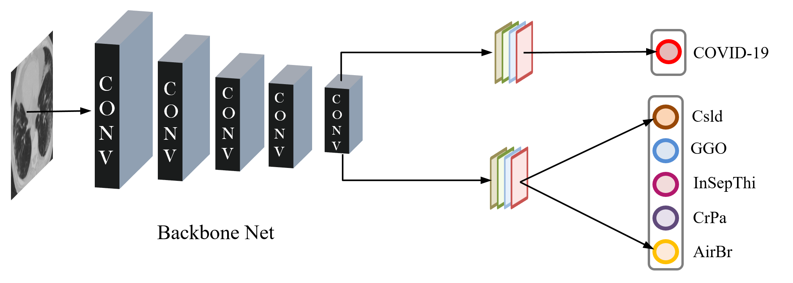
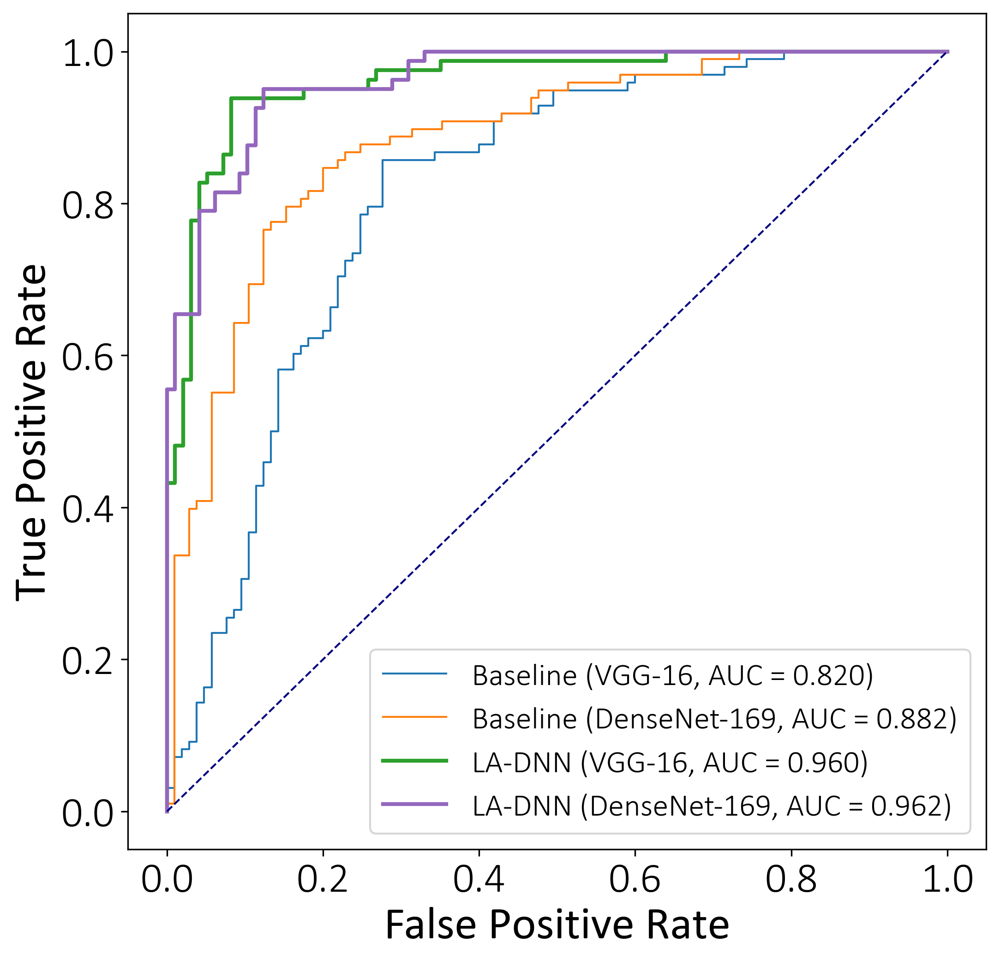
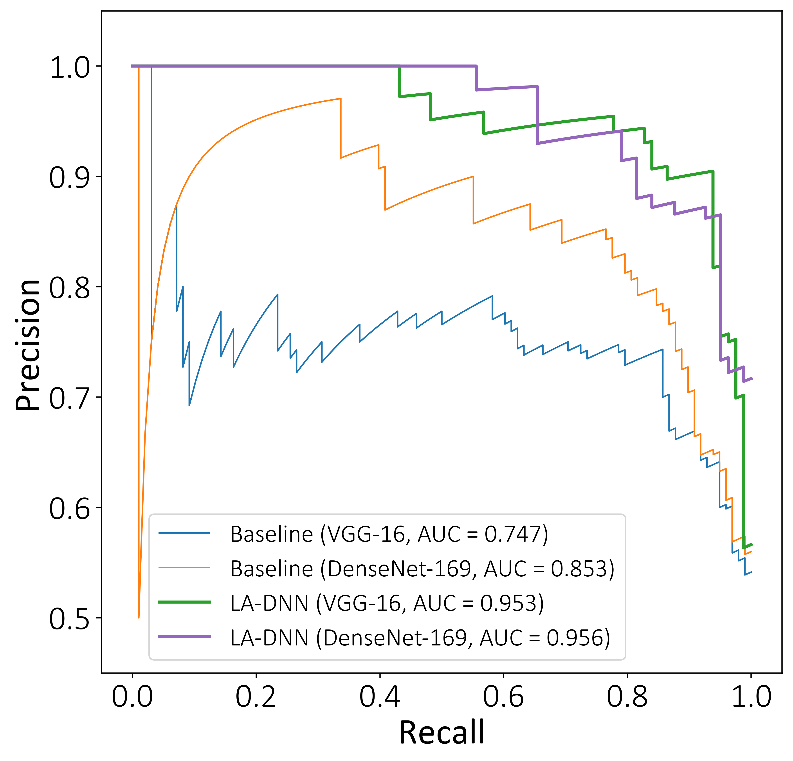
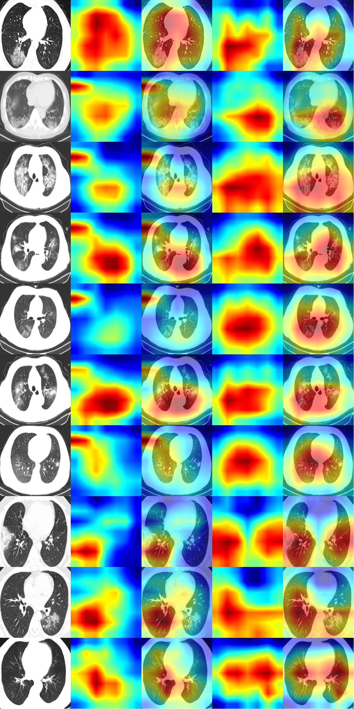
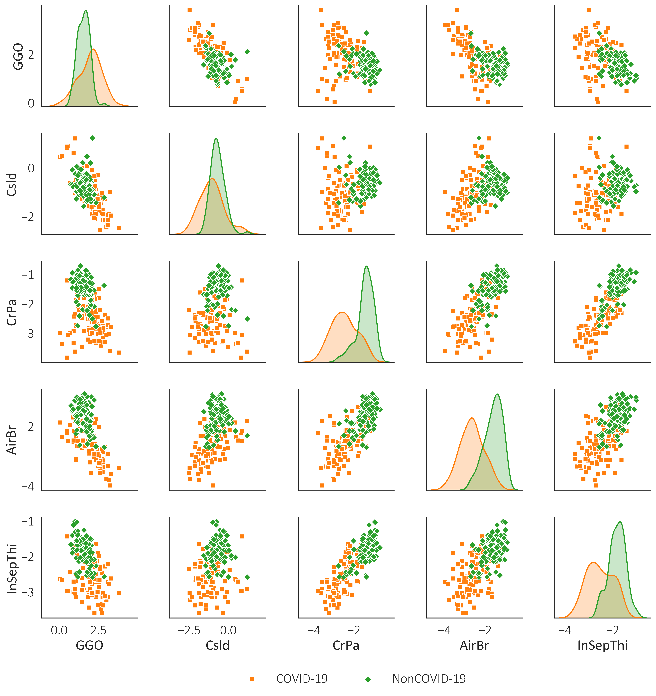

# LA-DNN for COVID-19 diagnosis

## :fire: NEWS :fire:

- **[2020/07/08]** :boom: (Updated by *Xiaoxue Gao*)

  * The pre-trained model can be downloaded from [Baidu Netdisk](https://pan.baidu.com/s/1fnvSEnjRGXh--KY9IY3NpA)(extract code w3i1).

- **[2020/06/29]** :boom: (Updated by *Xiaoxue Gao*)

  * Upload the pre-trained model which is split into 7 files in `./best_model/`.

- **[2020/06/10]** :boom: (Updated by *Xiaoxue Gao*)

  * Release new data in `./New_data/6.10/`.

- **[2020/06/02]** :boom: (Updated by *Mengshuang He*)

  * Release new data in `./New_data/6.2/`.

- **[2020/05/27]** :boom: (Updated by *Xiaoxue Gao*)

  * Release new data in `./New_data/5.27/`.
  * Update the model of [Online Diagnosis System](https://www.covidct.cn/), the performance is as follows:

       |  Date      |   ACC   |   AUC   |    F1   |  Recall |
       | :-----:    | :-----: | :-----: | :-----: | :-----: |
       | 2020/05/27 |   90.4  |   96.2  |   90.1  |   95.1  |
       
- **[2020/05/18]** :boom: (Updated by *Xiaoxue Gao*)

  * Release new data in `./New_data/5.18/`.
  * Update `./New_data/New_COVIDCT_meta(update to 5.18).csv` and `./New_data/New_NonCOVIDCT_meta(update to 5.18).csv`.

- **[2020/05/16]** :boom: (Updated by *Mengshuang He*)

  * Release new data in `./New_data/5.16/`.
  * Update `./New_data/New_COVIDCT_meta(update to 5.16).csv` and `./New_data/New_NonCOVIDCT_meta(update to 5.16).csv`.

- **[2020/05/14]** :boom: (Updated by *Xiaoxue Gao*)

  * Release new data in `./New_data/5.14/`.
  * Update `./New_data/New_COVIDCT_meta(update to 5.14).csv` and `./New_data/New_NonCOVIDCT_meta(update to 5.14).csv`.
  * Update the model of [Online Diagnosis System](https://www.covidct.cn/), the performance is as follows:

       |  Date      |   ACC   |   AUC   |    F1   |  Recall |
       | :-----:    | :-----: | :-----: | :-----: | :-----: |
       | 2020/05/14 |   88.1  |   92.9  |   87.9  |   86.2  |
 
- **[2020/05/13]** :boom: (Updated by *Xiaoxue Gao*)

  * Release new data in `./New_data/5.13/`.
  * Update `./New_data/New_NonCOVIDCT_meta(update to 5.13).csv`.

- **[2020/05/11]** :boom: (Uploaded by *Mengshuang He*)

  * Upload new meta-information containing auxiliary labels about [COVID-CT-Dataset]( https://github.com/UCSD-AI4H/COVID-CT) in `./data_split/COVID-CT-MetaInfo_new.csv`. 

- **[2020/05/07]** Create repository.

## 1. Background

Chest (computed tomography) CT scanning is one of the most important technologies for COVID-19 diagnosis in the current clinical practice, which motivates more concerted efforts in developing AI-based diagnostic tools to alleviate the enormous burden on the medical system. We develop a lesion-attention deep neural network (LA-DNN) to predict COVID-19 positive or negative with a richly annotated chest CT image dataset. The CT image dataset contains 746 public chest CT images of COVID-19 patients collected from over 760 preprints, and the data annotations are accompanied with the textual radiology reports. We extract two types of important information from these annotations: One is the flag of whether an image indicates a positive or negative case of COVID-19, and the other is the description of five lesions on the CT images associated with the positive cases. The proposed data-driven LA-DNN model focuses on the primary task of binary classification for COVID-19 diagnosis, while an auxiliary multi-label learning task is implemented simultaneously to draw the model's attention to the five lesions of COVID-19 during the training. The joint task learning process makes it a highly sample-efficient deep model that can learn COVID-19 radiology features effectively with very limited samples. Our code is public in `./Code/`.

<p align="center">
     <br />
    <em> 
    Figure 1. The architecture of the proposed lesion-attention deep neural networks.
    </em>
</p>

## 2. Data

* We used this public dataset: **"COVID-CT-Dataset: a CT scan dataset about COVID-19."** arXiv, 2020. <br>
  * More information about this base dataset can be found at:<br>
    * arXiv: https://arxiv.org/abs/2003.13865 <br>
    * dataset: https://github.com/UCSD-AI4H/COVID-CT<br>
  * We used the image caption in the meta-information provided by this dataset to add auxiliary labels for each COVID-19 sample, including Ground-glass opacities (GGO), Consolidation (Csld), Crazy paving appearance (CrPa), Air bronchograms (AirBr), and Interlobular septal thickening (InSepThi). New meta-information containing auxiliary labels can be found in `./data_split/COVID-CT-MetaInfo_new.csv`.
  * The split information of fine-tuned data can refer to `./data_split/train_meta.csv`, `./data_split/val_meta.csv`, `./data_split/test_meta.csv`.
  
* We will keep collecting new CT images for both COVID-19 and NonCOVID-19.
  * New samples will be updated at this folder `./New_data/`.
  * This dataset will be updated periodically. Hence, we name the folder of new data with the corresponding timestamp as a subdirectory of `./New_data/`. Suppose we add new CT images added on May 14, then the path will be:`./New_data/5.14/`. The positive and negative samples are separately stored with two zip files with names `./New_data/5.14/5.14_covidct.zip` and `./New_data/5.14/5.14_nocovidct.zip` respectively.
  * The meta-information of the new samples (e.g., image name, label, collection date and source, etc.) will be continuously updated in `./New_data/New_COVIDCT_meta(update to 5.14).csv` and `./New_data/New_NonCOVIDCT_meta(update to 5.14).csv`.

## 3. Online Diagnosis System

An online system has been developed for fast online diagnoses using CT images at the web address https://www.covidct.cn/. 

:satisfied: Welcome to visit!!! :satisfied:

  * You can quickly test a single sample or batch of samples following the navigation bar **Test → Single Image** or **Test → Batch of Images**.
  * We encourage clinicians, radiologists, and researchers to share more data to help us to improve this system. Data sharing can be achieved via the **Data Collection** channel of our website.

<p align="center">
     <br />
    <em> 
    Figure 2. Navigation bar of Online Diagnosis System.
    </em>
</p>

## 4. Results

### 4.1 ROC & PRC

<p align="center">
       <br />
    <em> 
    Figure 3. Performance of our proposed LA-DNN model for COVID-19 diagnosis in comparison with the baseline (Left: ROC curves, Right: Precision-recall curves; This is the latest result after adding new data).
    </em>
</p>

### 4.2 Lesion attention map

<p align="center">
     <br />
    <em> 
    Figure 4. Grad-CAM++ visualization for the baseline and our LA-DNN model with the backbone net of DenseNet-169 (Column 1 represents the original CT scans; Columns 2 and 3 are the class activation maps of the baseline; Columns 4 and 5 are the class activation maps of our LA-DNN model).
    </em>
</p>

### 4.3 Visualization of the primary vs. auxiliary tasks

<p align="center">
     <br />
    <em> 
    Figure 5. Plots of the pairwise relationships among the five lesions on making the final binary classification of COVID-19.
    </em>
</p>

## 5. Dependence

* Python 3.7.3
* PyTorch 1.5.0

## 6. More Information

We uploaded a video on YouTube to introduce our project. The web address is https://youtu.be/MripiZ-1pHU.

## 7. Citation

The details of our model can be found in this preprint: [Online COVID-19 diagnosis with chest CT images: Lesion-attention deep neural networks](https://www.medrxiv.org/content/10.1101/2020.05.11.20097907v1).<br>

Please cite our paper if you find this work useful:
```
    @article {Liu2020.05.11.20097907,
      author = {Liu, Bin and Gao, Xiaoxue and He, Mengshuang and Lv, Fengmao and Yin, Guosheng},
      title = {Online COVID-19 diagnosis with chest CT images: Lesion-attention deep neural networks},
      year = {2020},
      doi = {10.1101/2020.05.11.20097907},
      publisher = {Cold Spring Harbor Laboratory Press},
      URL = {https://www.medrxiv.org/content/early/2020/05/14/2020.05.11.20097907},
      eprint = {https://www.medrxiv.org/content/early/2020/05/14/2020.05.11.20097907.full.pdf},
      journal = {medRxiv},
    }
```    
