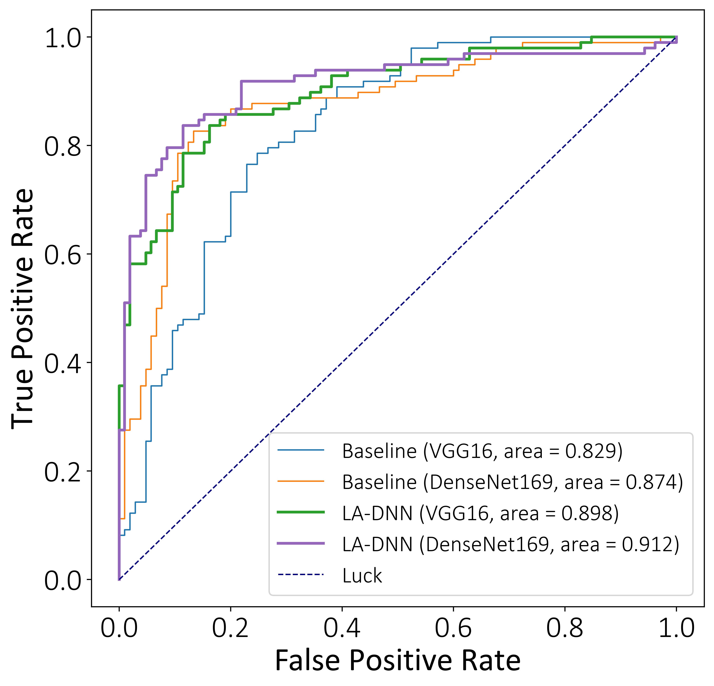
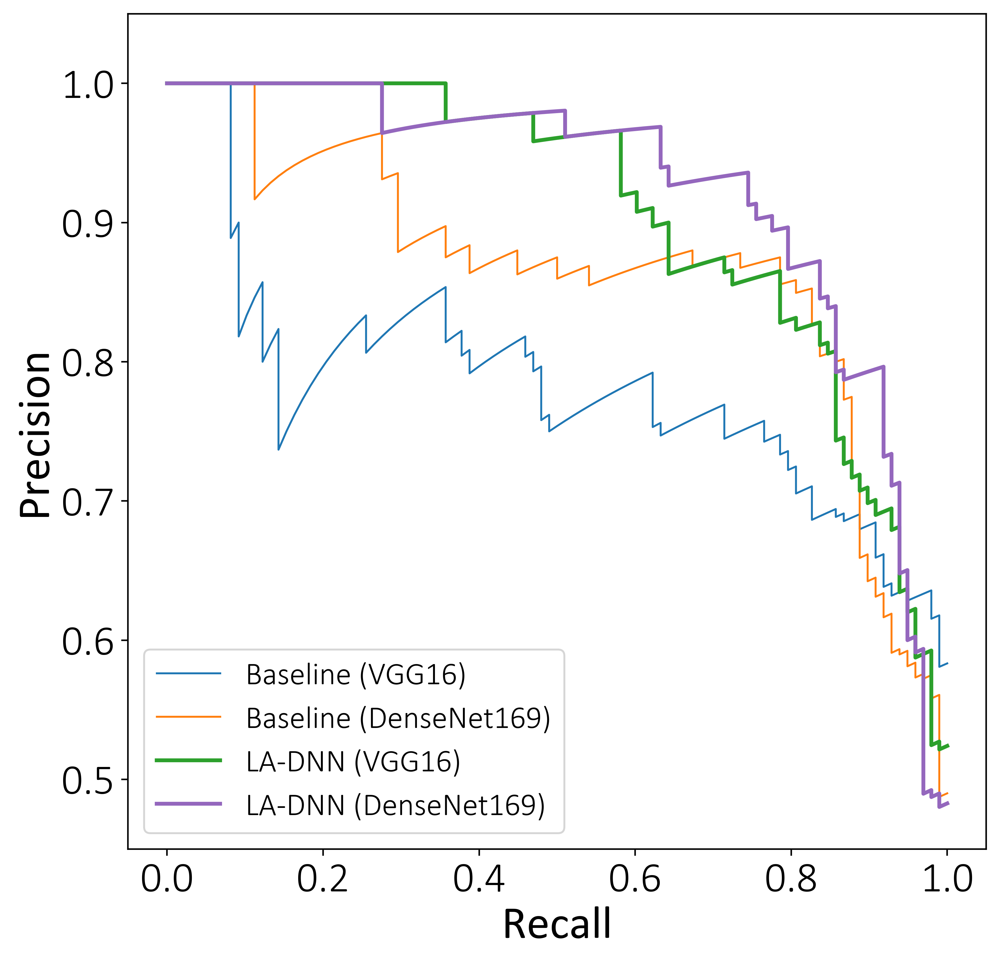

# LA-DNN for COVID-19 diagnosis

## :fire: NEWS :fire:

- [2020/05/13] :boom: Upload XXX. (Uploaded by XXX)

- [2020/05/12] :boom: XXX. (Updated by XXX)

- [2020/05/07] Create repository.

## 1. Background

Chest (computed tomography) CT scanning is one of the most important technologies for COVID-19 diagnosis in the current clinical practice, which motivates more concerted efforts in developing AI-based diagnostic tools to alleviate the enormous burden on the medical system. We develop a lesion-attention deep neural network (LA-DNN) to predict COVID-19 positive or negative with a richly annotated chest CT image dataset. The CT image dataset contains 746 public chest CT images of COVID-19 patients collected from over 760 preprints, and the data annotations are accompanied with the textual radiology reports. We extract two types of important information from these annotations: One is the flag of whether an image indicates a positive or negative case of COVID-19, and the other is the description of five lesions on the CT images associated with the positive cases. The proposed data-driven LA-DNN model focuses on the primary task of binary classification for COVID-19 diagnosis, while an auxiliary multi-label learning task is implemented simultaneously to draw the model's attention to the five lesions of COVID-19 during the training. The joint task learning process makes it a highly sample-efficient deep model that can learn COVID-19 radiology features effectively with very limited samples.

      
    <em> 
    Figure 1. The architecture of the proposed lesion-attention deep neural networks.
    </em>

## 2. Online Diagnosis System

An online system has been developed for fast online diagnoses using CT images at the web address https://www.covidct.cn/. Welcome to visit our system!

## 3. Data

* We used this public datasets: **"COVID-CT-Dataset: a CT scan dataset about COVID-19."** arXiv, 2020.  
  * The following link can help you get a detailed description about the dataset. 
    arXiv: https://arxiv.org/abs/2003.13865  
    dataset: https://github.com/UCSD-AI4H/COVID-CT 
  * XXX
  
* We are still continuously collecting new CT images, including COVID-19 and NonCOVID-19, in order to further optimize the performance of our model.
  * XXX

## 4. Result

### 4.1 ROC

      
    <em> 
    Figure 2. ROC curves of the baseline and LA-DNN.
    </em>

### 4.2 PRC

      
    <em> 
    Figure 3. Precision-recall curves of the baseline and LA-DNN.
    </em>

### 4.3 Lesion attention map

      
    <em> 
    Figure 4. Grad-CAM++ visualization for the baseline and our LA-DNN model with the backbone net of DenseNet-169.
    </em>

### 4.4 Visualization of the primary vs. auxiliary tasks

      
    <em> 
    Figure 5. Plots of the pairwise relationships among the five lesions on making the final binary classification of COVID-19.
    </em>

## 5. Citation

Our method and results are described in [Online COVID-19 diagnosis with chest CT images: Lesion-attention deep neural networks](https://www.medrxiv.org/content/10.1101/2020.05.11.20097907v1). 
Please cite our paper if you find the work useful:

    @article {Liu2020.05.11.20097907,
      author = {Liu, Bin and Gao, Xiaoxue and He, Mengshuang and Lv, Fengmao and Yin, Guosheng},
      title = {Online COVID-19 diagnosis with chest CT images: Lesion-attention deep neural networks},
      year = {2020},
      doi = {10.1101/2020.05.11.20097907},
      publisher = {Cold Spring Harbor Laboratory Press},
      URL = {https://www.medrxiv.org/content/early/2020/05/14/2020.05.11.20097907},
      eprint = {https://www.medrxiv.org/content/early/2020/05/14/2020.05.11.20097907.full.pdf},
      journal = {medRxiv},
    }
    
## 6. Questions

If you have any questions about our paper or online diagnosis system, please feel free to contact [Xiaoxue Gao](gxx3027@163.com) 
or [Mengshuang He](hms1216@126.com) via E-mail.
